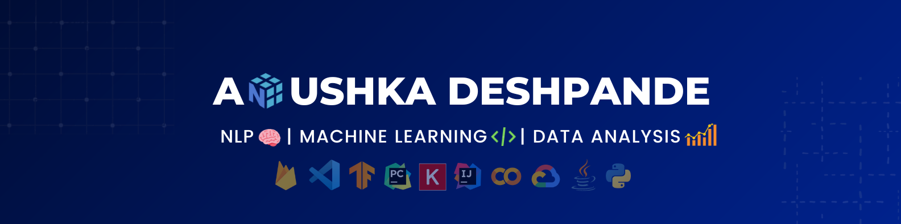

# .gif)[Anushka Deshpande](https://github.com/anushka-deshpande) 

👨‍🎓I am Anushka Deshpande, currently pursuing a Masters Degree in Computer Science at USC.  
💻I am a **Machine Learning** and **Data Science** enthusiast.  
💬Connect with me on LinkedIn: [Anushka Deshpande](https://www.linkedin.com/in/anushka-deshpande153/). 
📫 **Email** me at: anushkaa@usc.edu. 
⚡ **Fun Fact**: I also post my Mandala Artwork on Instagram - [@The.Floral.Notepad](https://www.instagram.com/the.floral.notepad/).

 
 
 <h4 align="center">Mostly Using:</h4>

Scikit-learn | Pandas | Keras

 

<!--🏆🥇I am also into **competitive programming**. I am **2-star⭐️** coder at Codechef.  -->

<!--
**anushka-deshpande/anushka-deshpande** is a ✨ _special_ ✨ repository because its `README.md` (this file) appears on your GitHub profile.

Here are some ideas to get you started:

- 🔭 I’m currently working on ...
- 🌱 I’m currently learning ...
- 👯 I’m looking to collaborate on ...
- 🤔 I’m looking for help with ...
- 💬 Ask me about ...
- 📫 How to reach me: ...
- 😄 Pronouns: ...
- ⚡ Fun fact: ...
-->
